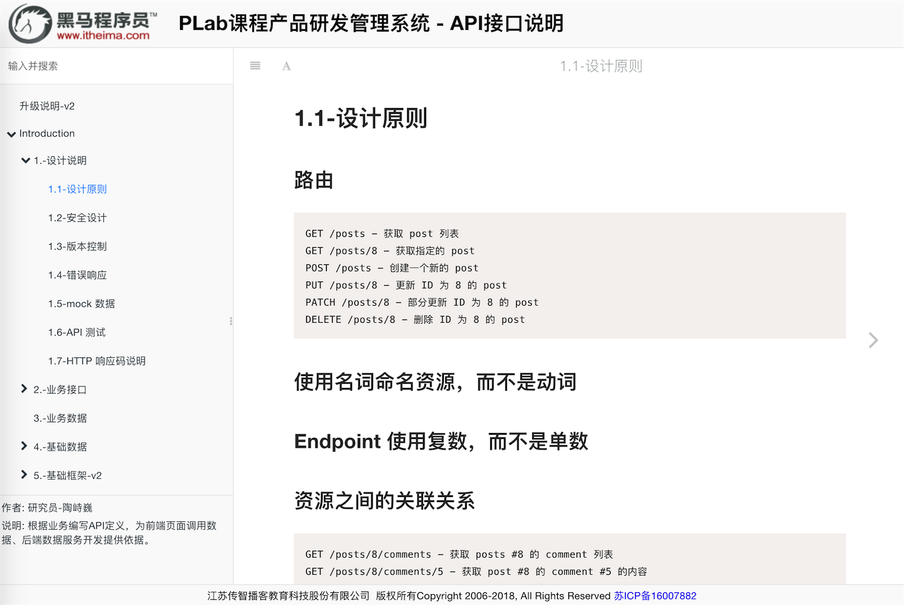

# GitBook 技术文档模板 - theme-itheima



## 1. 安装

配置 `book.json` ，如没有这个文件请创建

- 配置itheima模板

```json
  "plugins": [
    "theme-itheima"
  ],
```

- 推荐配置，支持（导航折叠、分隔条拖动、代码高亮优化、关闭分享）

```json
{
  "title": "管理系统 - API接口说明",
  "author": "王某某",
  "description": "本文档撰写摘要说明",
  "language": "zh-hans",
  "copyright": "xxxxxxxxxxx股份有限公司 &nbsp;版权所有Copyright 2006-2018, All Rights Reserved",
  "plugins": [
    "theme-itheima",
    "splitter",
    "prism",
    "expandable-chapters",
    "-sharing"
  ],
  "pluginsConfig": {
    "theme-default": {
      "showLevel": false
    }
  }
}
```

## 2. 安装插件

```bash
gitbook install
```

## 3. 本机运行

```bash
gitbook serve
```

## 4. 发布html

```bash
gitbook build
```

## License

Apache-2.0 © [研究院研发部]()
